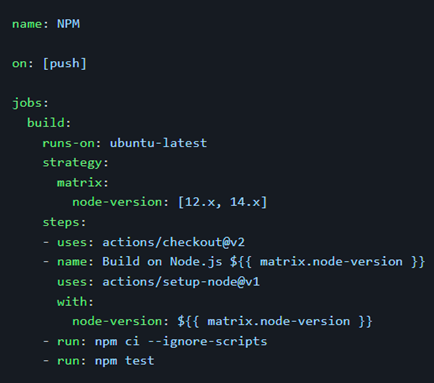
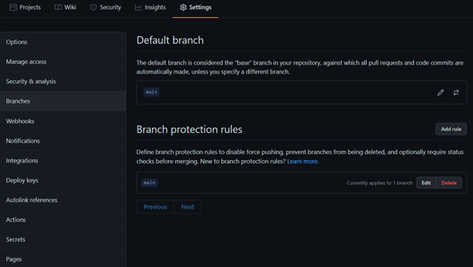
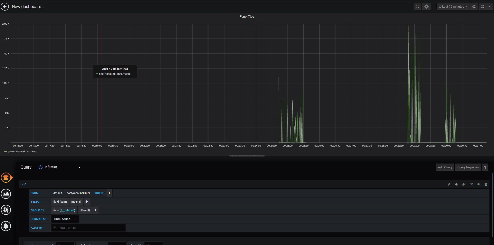
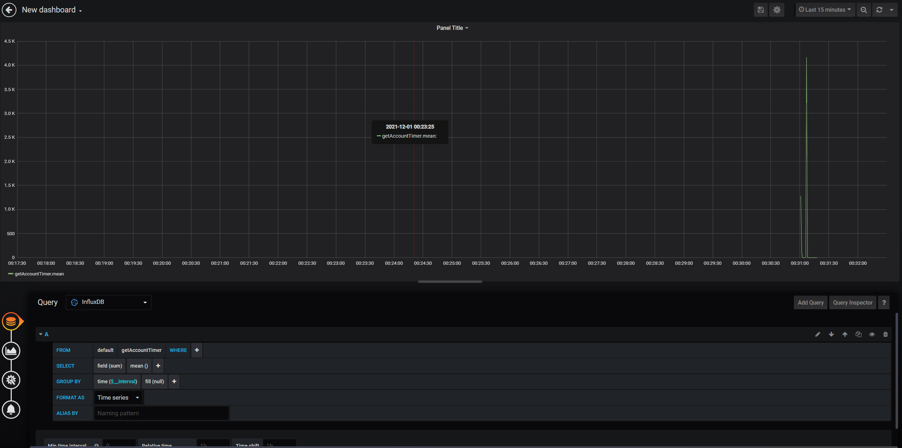
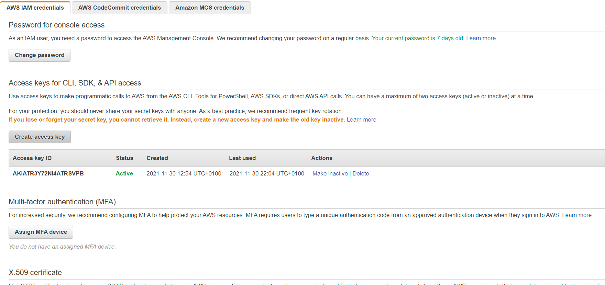

# EksamenPRG301_DevOps_2021

## Oppgave-DevOps

### Drøft 

#### Beskriv med ord eller skjermbilder hvordan man kan konfigurere GitHub på en måte som git bedre kontroll på 
utviklingsprosessen.
Spesielt med tanke på å hindre kode som ikke kompilerer med og feilende tester fra å bli integrert i main branch.

####Konfigurer integrasjon med GitHub Actions i koden

Med Github Actions kan man bygge, teste og deploye kode rett fra GitHub.
* I repositoryet sitt lager man en katalog som heter `.github/workflows`.
* Lag en fil som heter `npm.yml`. Her kan man konfigurere en enkel workflow sjekk ved hjelp av GitHub



Dette er et eksempel tatt fra GitHub [exercise 3.0-cd-exercise](https://github.com/PGR301-2021/03-cd-exercise).
Det kan være lurt å ha noen tester som kjører for å se om branch protection fungerer

####Konfigurer branch protection på koden i GitHub med status check

* Gå til setting of velg Branches fra listen på venstre side
* Trykk på Add rule



* Skriv navn på branchen du vil beskytte og legg til `require status check to pass before merging`. Alle commits vil 
* ha en status som definerer den(*error, failure, pending, success*). 
  Ved å velge dette alternativet, så merger vi kun pull requests med status som `success` til branchen.

###Beskriv med ord eller skjermbilder hvordan GitHub kan konfigureres for å sikre at minst ett annet medlem av teamet har godkjent en pull request før den merges

Her gjør vi nesten det samme som vi gjorde over. Vi konfigurerer GitHub actions helt likt. Det eneste som erforskjellig 
er hvilke regler du har på branch protection.

####Konfigurer branch protection på koden i GutHub med require approved pull request
* 
* Gå til settings og velg branches fra listen på venstre
* Trykk på add rule
* Her velger du `require a pull request before merging` og velger `Require approvals`. 
  Du kan også velge hvor mange som må godkjenne for at det skal kunne merges.

**fordeler med peer-review**
1. Forbedrer kvaliteten på koden og reduserer bugs til produksjon
2. Hjelper deg å lære fra andre utviklere og motsatt
3. Kunnskaps overføring innad i utvikler teamet. Og forståelsen for hva de andre på teamet holder på med

###Beskriv hvordan arbeidsflyten for hver enkelt utvikler bør være for å få en effektiv som mulig utviklingsprosess,spesielt hvordan hver enkelt utvikler bør jobbe med brancher i GitHub hver gang han eller hun starter en ny oppgave.

Arbeidsflyten for hver enkelt utvikler bør følge GitFlow. GitFlow er en branch model utviklet for Git.

Når man starter en ny oppgave, lager man en ny branch fra development branchen. Her henter vi den mest oppdaterte 
versjonen av prosjektet som inkluderer alt som enda ikke er utgitt, samt det som allerede er utgitt.

Når funksjonen eller oppgaven er klar for release, merger man den tilbake inn i development branchen.

Når man skal gi ut nye funksjoner, lages det en egen release branch av development branchen. Denne release branchen 
blir gitt ut i et test-miljø, testet og problemer som oppdages fikset direkte i denne branchen.
Denne syklusen`deploy -> fix -> redeploy -> retest` holder på helt til man er fornøyd nok til at den kal releases til 
kunder.
Nå merger vi release branchen med både main og development branchen slik at både kunden og utviklerene får den nyeste 
versjonen av prosjektet.

**Fordeler med GitFLow**
1. Paralell utvikling blir enkelt ved å isolere nye funksjoner og merge tilbake når featuren er ferdig.
2. Samarbeid mellom utviklere øker, spesielt hvis man bruker peer-review som beskrevet over. Funksjon er isolert. Og 
3. man kan ha fullt fokus på den.
4. Man har en egen developer branch hvor alle ferdige funksjoner ligger. Om man skal lage en ny funksjon inneholder 
5. den branchen med alle de nye funksjonene som enda ikke er utgitt på main.

### Drøft

####SkalBank har bestemt seg for å bruke DevOps som underliggende prinsipp for all systemutvikling i banken. Er fordeling av oppgaver mellom API-teamet of "Team Dino" problematisk med dette som utgangspukt? Hvilke prinsipper er det som ikke etterleves her? Hva er i så fall konsekvensen av dette?
fordelingen av oppgaver mellom API-teamet of "Team Dino" er problematisk. det å ha et team som jobber med manuelle tester gir dårlig flyt i produksjonen. Store systemer med lang levetid har et omfattende regine når man skal gjøre en full test av systemet
Feilrettingsrunder med manuelle tester vil forekomme, da retting av de feilene de fant vil føre til enda flere feil. Da må man kjøre en ny full test!
Prinsippet som ikke følges her, er `automatiserte tester` og `waste med manuelle tester`

Dette git også en arbeidsmoral til API-teamet om at "det er ikke så farlig" å release kode de vet har masse feil. Så lenge de leverer innen deres frist. Det er da opp til "Team Dino" å finne feilen(e).

Det beskrives i oppgaveteksten at det er mellom fem og ti utviklere som kontinuerlig comitter til main branch. Her etterleves ikke prinsippet om `kontinuerlig integrasjon` og `kontinuerlig leveranse`(CI/CD). Det å kjøre Trunk Basen Development istedenfor f.eks GitFlow har flere konsekvenser
Det vlir mye mindre åpenhet i utviklingen og det er ingen som vet hva de andre holder på med. Det kjøres heller ingen tester eller kompilering av koden. Dette gjør det mye vanskeligere å rette opp eventuelle(uungåelige) feil i koden.

Det tredje prinsippet som blir brutt er et puntk i Waste. Jeg antar at det går litt tid mellom hver gang "Jens" sender en JAR til "Team Dino". Og selv om det diskuteres om man skal ansette flere til "Team Dino", antar jeg at de "venter" på en ny JAR fil.
Dette er imot `venting` prinsippet i Waste. Dessuten må de gjennom flere runder med tester noe som jeg ser på som en `unødvendighet` på grunn av `manuelle prosesser`.  

#Oppgave-Feedback
####Hvilke spørringer kan sensør gjøre for å analysere problemet?
Selsorn kan kjøre kall på `@Timed` anotasjonene jeg har lagt inn på de forskjellige endepunktene

`select sum from postAccountTimer`

`select sum from getAccountTimer`

`select sum from transferTimer`



#Oppgave-Terraform
### Drøft
#### Hvorfor funket terraform koden i dette repoet for "Jens" første gang det ble kjørt? Og hvorfor feiler det for alle andre etterpå, inkludert Jens etter at han ryddet på disken og slettet terraform.sfstate filen?
`terraform.tfstate` inneholder terraform sin oversikt over hvordan infrastruktur og kode henter sammen. S3 kjører ikke i dette tilfellet i backend, men lokalt. Det vil si at etter Jens slettet `terraform.tfstate` filen, har heller ikke han oversikt over hvordan infrastrukturen og koden henger sammen.

Med denne erroren betyr det at S3 bucketen har tidligere vært laget, som Jens hadde gjort. Man blir nøtt til å importere de eksisterende terraform konfigurasjonene fra S3 bucketen vedå hente den allerede opprettede state filem som er blitt lagret i S3 bucketen.

Dette kan oppnås ved å bruke `data` istedenfor `resource` til å hente ut informasjon om infrastruktur som ligger i en AWS-konto. Og bruke denne informasjonen i infrastruktur koden. Selv om ikke de ressursene som man refererer til er en del av terraform koden på lokal maskin. Også kan man modifisere på den og lage andre ressurser som bruker den bucketen.
Man har altså ikke en referanse til bucketen fra før av, fordi man selv ikke har laget ressursen med terraform. 

###AWS CLI 
dersom sensor ønsker å lage en bucket kan man bruke kommandolinjen 

`aws s3api create-bucket --bucket my-bucket --region eu-west-1`

Har sensor også lyst til å konfigurere AWS nøkler kan dette gjøres på to måter.
1. Inne i CLI
2. Inne i Console(UI)
#### Inne i CLI
vi antar at sensor sitt bruker navn er `sensor`. 

`aws iam create-access-key --user-name sensor`

er linjen man skriver dersom man vil konfigurere aws nøkler i CLI

#### Inne i Console(UI)
dersom man logger inn på console.aws.amazon.com siden og trykker på navnet sitt øverst i høyre hjørne. Faller en lyten meny ned. Her velger man `security credentials`. Da kommer man inn på en side som bilde under viser
Her kan vi trykke på `Create access key`, for å generere et par nøkler til oss.



###Terraform kode
for å lage et ECR repository i koden skriver man følgende kode i en infra .tf fil: 
```
resource "aws_ecr_repository" "my_repo"{
  name = "repo_name"

  image_scanning_configuration {
    scan_on_push = true
  }
}
```
# Oppgave-Docker
#### Kommandolinje for å bygge et image:
`docker build . --tag skalbank --build-arg JAR_FILE=target/demo-0.0.1-SNAPSHOT.jar`
####Kommandolinje for å starte en container
`docker run skalbank:latest`
####Kommandolinje for å starte to containere samtidig, uten port-konflikt
`docker run -p 7777:8080 skalbank:latest`

`docker run -p 8888:8080 skalbank:latest`

